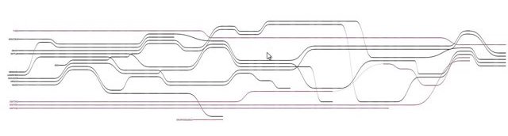
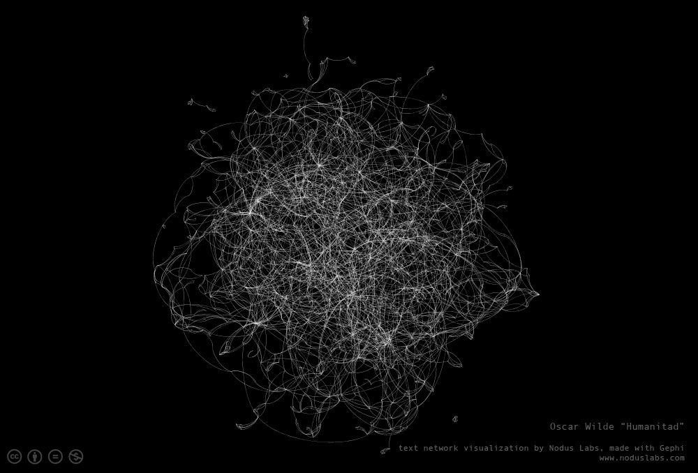

### Questions I am currently asking myself
* What kind of preprocessing should I be doing?
..- That is, should I remove **stop words** or keep them?
..- Is white space important within the visualization? If only for filling cells within the grid?
* What if God was one of us?
* What sort of NLP analysis should I be performing?
..- Named-entity recognition seems appealing, if only as a means of tracking who says what to whom
....- But I need to ensure the locations within the text itself are maintained. Otherwise, whats the point?
* Sentiment Analysis is attractive, but I need to come up with a metric for filtering said sentiments. I dont want the whole document to be Red (negative) and Green (positive). That would defeat the point
* Is this an appropriate method of representing Text data?

---
### Questions I have found answers to, or I have given up on
* _Nothing yet..._

---
### Papers to read
* [166.full.pdf](Papers/166.full.pdf)
* [01173155.pdf](Papers/01173155.pdf)
* [06691709.pdf](Papers/06691709.pdf)
* [06787190.pdf](Papers/06787190.pdf)
* [Information Visualization-2003-Brandes-40-50.pdf](Papers/Information Visualization-2003-Brandes-40-50.pdf)
* [p47-fekete.pdf](Papers/p47-fekete.pdf)
* [p101-robertson.pdf](Papers/p101-robertson.pdf)
* [p119-deller.pdf](Papers/p119-deller.pdf)
* [PenAndPaperNotes.pdf](Papers/PenAndPaperNotes.pdf)
* [procamiasymp00002-0378.pdf](Papers/procamiasymp00002-0378.pdf)
* [taln-recital2013_volume3.pdf](Papers/taln-recital2013_volume3.pdf)
* [Yafeng-VAST.pdf](Papers/Yafeng-VAST.pdf)

---
### Papers Read (With links to discussions)
* _Might want to get on that..._

---
### Images of Interest (Those that _inspire_ or at least encourage me to _inquire_)
* StoryFlow
* 
* Annotated StoryFlow
* 
* [The xkcd comic which inspired StoryFlow](http://xkcd.com/657/large/)
* A Sweet visualization from [nodus labs](www.noduslabs.com)
* 

---
### Some really sweet blogs and links to cool text based visualizations
*[noduslabs](http://noduslabs.com/)
*[textexture](http://textexture.com/index.php)
*[perso](http://perso.ens-lyon.fr/adrien.barbaresi/blog/?p=1157)
*[datamining](http://datamining.typepad.com/data_mining/dataviz/)
*[meatballwiki](http://meatballwiki.org/wiki/TextVisualization)
*[searchuserinterfaces](http://searchuserinterfaces.com/book/sui_ch10_visualization.html)
*[usagainstthemachines](http://usagainstthemachines.com/2011/01/26/network-visualization/)
*[gajitz](http://gajitz.com/information-city-digital-visualization-of-invisible-data-flow/)
*[westgrid](https://www.westgrid.ca/research-showcase/susan_brown)
*[vosviewer](http://www.vosviewer.com/Text-mining-and-visualization-using-VOSviewer)
*[asis](http://www.asis.org/Publications/ARIST/vol39ZhuFigures.html)
*[noumentalia](http://www.noumentalia.de/news/visual-text-analytics-using-semantic-networks-and-interactive-3d-visualization/)

---
### The Issue with dimensionality in Volume rendering  *02/02/2015*
Ive noticed in my search for Text visualizations that there is almost nothing in
the way of Volume Rendered Text. That is, nobody has taken some text, stuffed
the data into a 3D grid, and rendered it using typical Volume Rendering
Algorithms. Whats the deal?!

I am beginning to think the reason for this is because there is no real
dimensionality to the data beyond 1D. So far every visualization of text based
data Ive seen consistently uses network graph visualizations. Obviously there is
good reason for this. Relational network graphs are a superior way of
representing the relationships found within a document, or set of documents.
Still, why cant we do the same thing but as a volume instead?

### The Issue with data PreProcessing data  *02/02/2015*
Obviously its going to be necessary to preprocess the data in SOME way shape, or
form. Questions I am asking myself however are having to do with what **types**
of preprocessing steps do I want to perform. For that matter, what types of NLP
analyses should I be doing? What do I care about and want to preserve, and what
can I get rid of?

