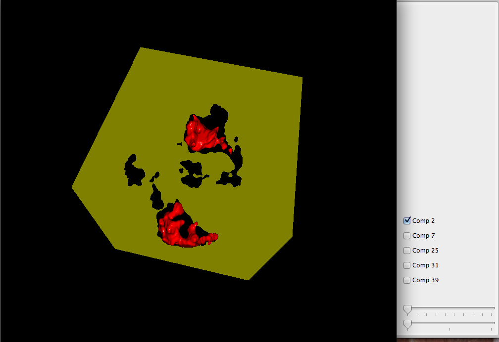
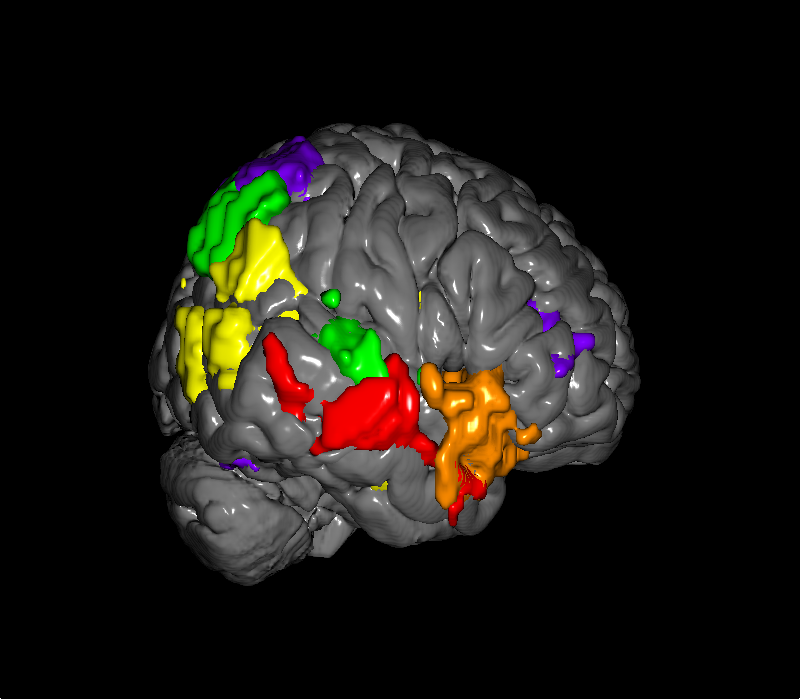
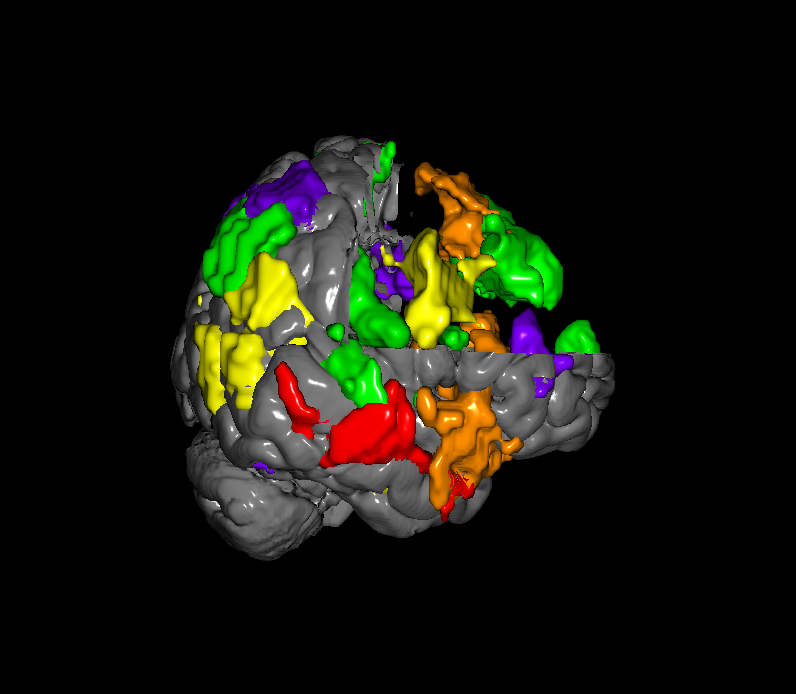
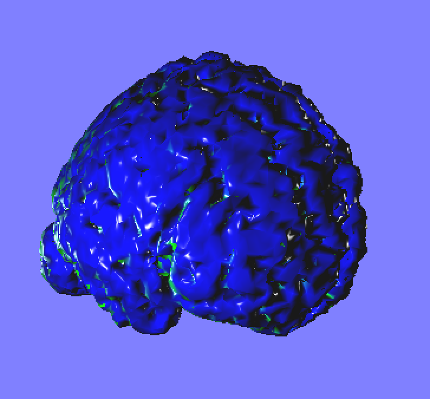

### Questions I am currently asking myself
* How best do we represent time?
  - Chronovolumes?
* What do the domain experts want and need?
* Stereoscopic visualizations?
* Is there a data structure which effectively compresses temporal datasets?
  - Time-Space Partition trees? Are they useful? What does the literature say?
* How do we solve the problem of moving data in and out of the GPU?
* Marching Cubes or Ray Casting?
* C++/OpenGL, VTK, THREE.js?
  - Can I use VTK with multiple rendering targets?
  - What are the implications of using the web?

---
### Papers in the queue

* *Hänel, C., Pieperhoff, P., Hentschel, B., Amunts, K., & Kuhlen, T. (2014). Interactive 3D visualization of structural changes in the brain of a person with corticobasal syndrome. Frontiers in Neuroinformatics, 8(May), 42. doi:10.3389/fninf.2014.00042*

* *Wong, C., Oliveira, M. C. F., & Minghim, R. (2013). Multidimensional Projections to Explore Time-Varying Multivariate Volume Data. 2013 XXVI Conference on Graphics, Patterns and Images, D, 107–114. doi:10.1109/SIBGRAPI.2013.24*

* *Jang, Y., Ebert, D. S., & Gaither, K. (2012). Time-varying data visualization using functional representations. IEEE Transactions on Visualization and Computer Graphics, 18(3), 421–33. doi:10.1109/TVCG.2011.54*

* *Gu, Y., & Wang, C. (2011). TransGraph: Hierarchical Exploration of Transition Relationships in Time-Varying Volumetric Data. IEEE Transactions on Visualization and Computer Graphics, 17(12), 2015–2024. doi:10.1109/TVCG.2011.246*

* *Fall, M. D., Barat, E., Comtat, C., Dautremer, T., Montagu, T., & Stute, S. (2011). Continuous space-time reconstruction in 4D PET. 2011 IEEE Nuclear Science Symposium Conference Record, 2581–2586. doi:10.1109/NSSMIC.2011.6152696*

* *Wang, C., Yu, H., Grout, R. W., Ma, K.-L., & Chen, J. H. (2011). Analyzing information transfer in time-varying multivariate data. 2011 IEEE Pacific Visualization Symposium, 99–106. doi:10.1109/PACIFICVIS.2011.5742378*

* *Nguyen, T. K., Eklund, A., Ohlsson, H., Hernell, F., Ljung, P., Forsell, C., … Ynnerman, A. (2010). Concurrent Volume Visualization of Real-Time fMRI, Vi.*

* *Thakur, S., & Hanson, A. J. (2010). A 3D Visualization of Multiple Time Series on Maps. 2010 14th International Conference Information Visualisation, 336–343. doi:10.1109/IV.2010.54*

* *Wang, C., Yu, H., & Ma, K.-L. (2008). Importance-driven time-varying data visualization. IEEE Transactions on Visualization and Computer Graphics, 14(6), 1547–54. doi:10.1109/TVCG.2008.140*

* *Wald, I., Friedrich, H., Knoll, A., & Hansen, C. D. (2007). Interactive isosurface ray tracing of time-varying tetrahedral volumes. IEEE Transactions on Visualization and Computer Graphics, 13(6), 1727–34. doi:10.1109/TVCG.2007.70566*

* *Tost, D., Grau, S., Ferre, M., & Puig, A. (2006). Ray-casting time-varying volume data sets with frame-to-frame coherence. Electronic …, 6060(034), 1–12. Retrieved from http://proceedings.spiedigitallibrary.org/proceeding.aspx?articleid=728261*

* *Database, E. L. (2005). An Introduction to Information Visualization Techniques for Exploring Large Database Time Series Data Visualization Datasets, 1–28.*

* *Joshi, a., & Rheingans, P. (2005). Illustration-inspired techniques for visualizing time-varying data. IEEE Visualization 2005 - (VIS’05), 86–86. doi:10.1109/VIS.2005.54*

* *Woodring, J., & Shen, H. (2003). Chronovolumes: a direct rendering technique for visualizing time-varying data. Proceedings of the 2003 Eurographics/IEEE …, 27–35. Retrieved from http://dl.acm.org/citation.cfm?id=827054*

* *Shen, H.-W., Chiang, L.-J., & Ma, K.-L. (1999). A fast volume rendering algorithm for time-varying fields using a time-space partitioning (TSP) tree. Proceedings Visualization ’99 (Cat. No.99CB37067), 371–545. doi:10.1109/VISUAL.1999.809910*

---
### Papers Read (With links to discussions)
* Nothing yet...

---
### Images of Interest (Those that _inspire_ or at least encourage me to _inquire_)

---
### Some really sweet blogs and links to cool text based visualizations
* [Slice:Drop](https://github.com/slicedrop/slicedrop.github.com)
* [daniel haehn](http://danielhaehn.com/)
* [Everts2015EBW](http://tobias.isenberg.cc/VideosAndDemos/Everts2015EBW)
* [Isenberg2015SIV](http://tobias.isenberg.cc/VideosAndDemos/Isenberg2015SIV)
* [timeviz.net:](http://timeviz.net/) This is a fabulous resource on Temporal Visualizations
* [Everts2009DDH](http://tobias.isenberg.cc/VideosAndDemos/Everts2009DDH)
* [brainbrowser](https://brainbrowser.cbrain.mcgill.ca/)
* [brainder](http://brainder.org)

---
### Progress...

First pass at a Marching Cubes implementation, whole brain

First pass at a Marching Cubes implementation, clustered images... :-(

