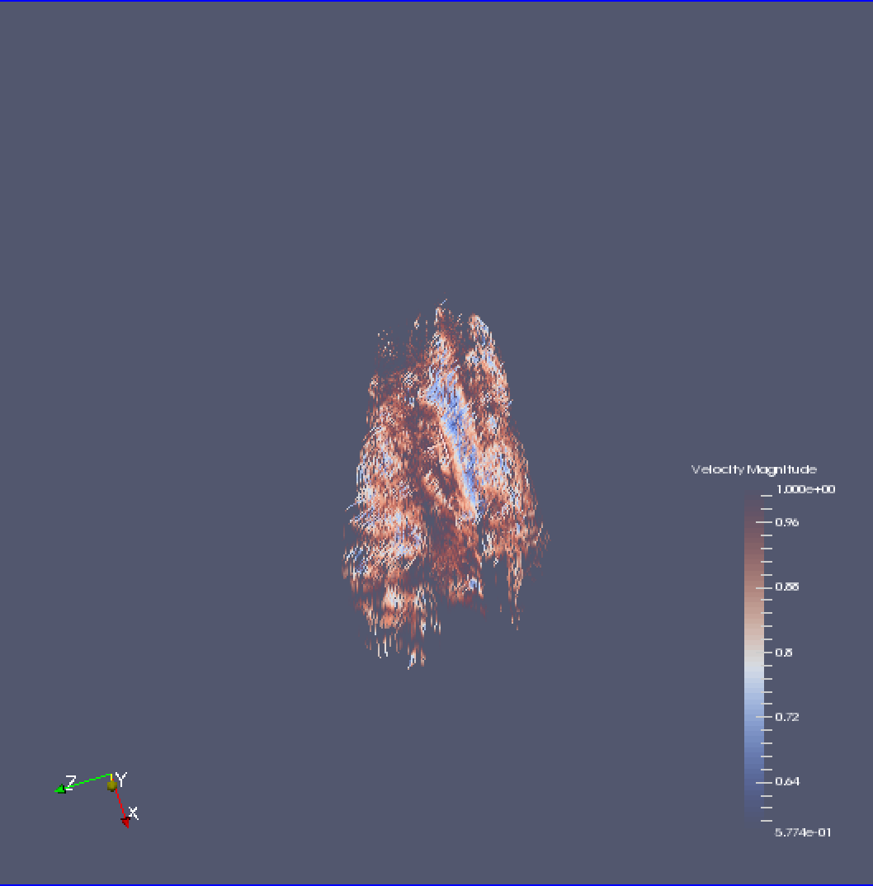
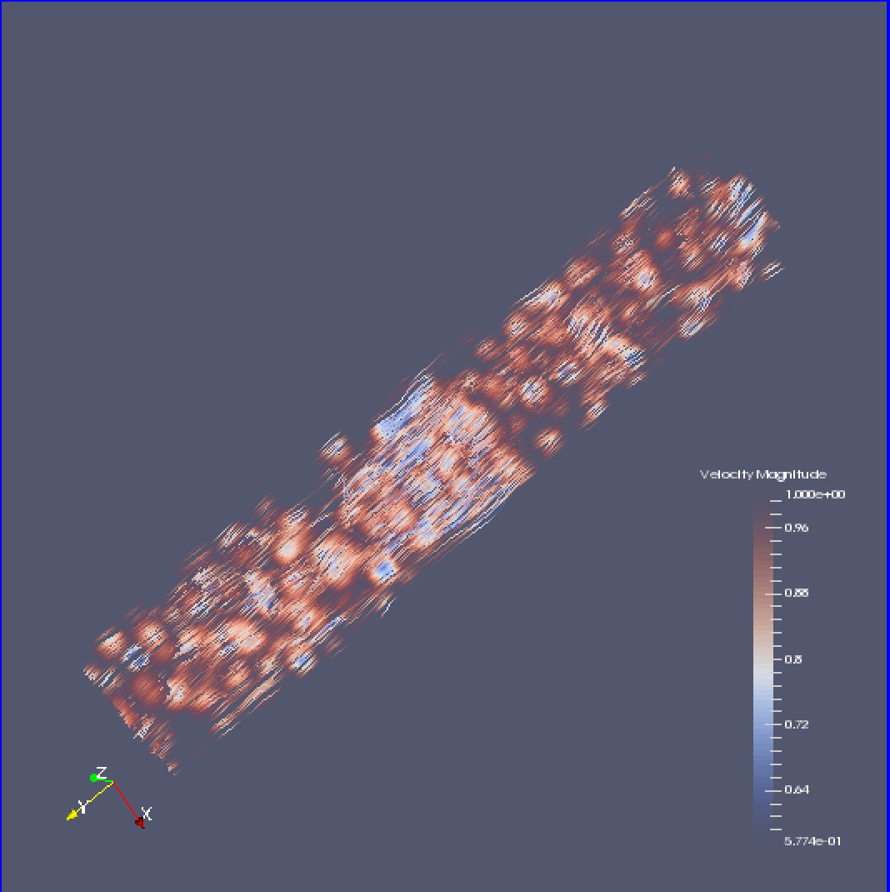
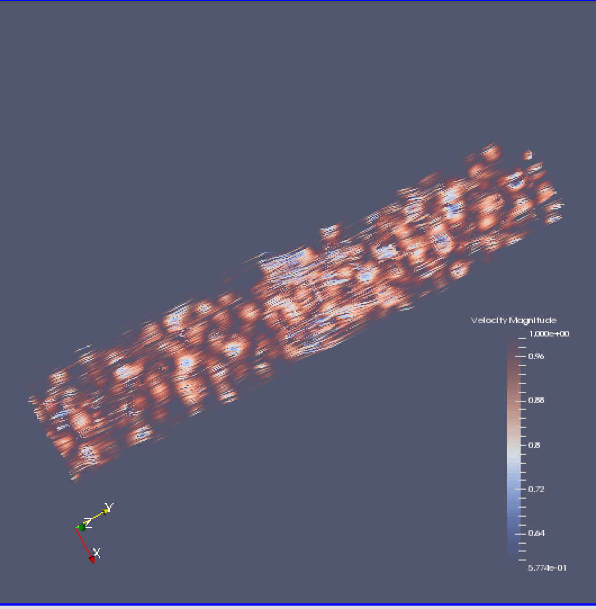
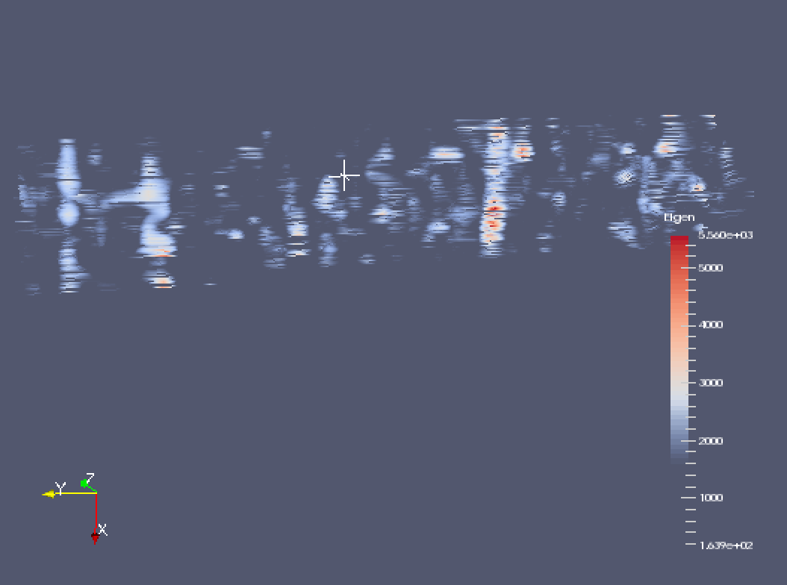

## A Proposal

#### Pre-Processing steps:
1. *Perform Sentiment Analysis with the following Dimensions in mind:*
  * Positive  |  Good,   X
  * Neutral |  Neutral, Y
  * Negative |  Bad,    Z
  - NLTK measures the polarity of the sentiment, which determines the degree of sentiment, but it only looks at positive <==> negative. We will need to come up with a way to split these into dimensions.

2. *Sentiment classification and analysis on the following levels:*
  - Whole Document Level    2D
    - Chapter Level           3D
      - Paragraph Level         3D -> 4D ? xy(Paragraph), z(Chapter/ParagraphS),
        - Sentence level
          - Word Level
            - Character level?

3. *What will I train my classifier on?*
  - Presently I am not all together concerned about what classification algorithm we use…at least not yet.
  - Ideally, an existing training corpora would be a fine 1st pass. Check out  for some pre-trained classifiers
  - Movie Reviews and Twitter data seems like an obvious first pass, though depending on the source data, I might want to look into something trained on less contemporary data sources

4. *Data organization*
  1. Organize data dimensions based on Good, Neutral, Bad sentiment. These measurements would be our orthogonal planes using MRI as an example, and would be synonymous with xyz. That is, Good == X axis, Neutral == Y, Bad == Z
    - This decision is arbitrary for the most part, and could be changed
  2. Depending on the size of the data, compose data at the chapter level, paragraph level, or maybe even sentence level. That is to say, each Slice would consist of an entire chapter/paragraph. Chapter and paragraphs are the most obvious choice in this instance as they have an inherent dimensionality about them.
    - It would be nice if I had words per page or similar type of information, that would be yet another method of slice composition

---
### Data Formatting
There is a great Python Module designed specifically for writting data to the new VTK XML format called [PyEVTK](https://bitbucket.org/pauloh/pyevtk) created by Paulo Herrera. The XML format itself is very powerful and flexible, which reduces the complexity of the problem greatly!

---
### Proposed Visualizations:
1. Using the RGB vectors as direction vectors, create vector Glyphs, hedgehog-style
2. Point cloud of sentiment?
3. Volume Rending / Ray casting / Slice based, some kind of color compositing/transfer function/LUT
4. Streamlines Tensors. These would be the DTI tracktography images you see.
  - A clustering method would have to be done before generating the streamlines, in order to determine the connected streamlines. This would give solid tensor lines.
  - I could then threshold this so we only saw the most well connected etc.
  - Or do seed based generations...the possibilities are endless!
5. Marching Cubes/ Isosurface volume rendering

---
### Progress...

---
### Questions I am currently asking myself

---
### Papers I am reading
<!--
* [166.full.pdf](Papers/166.full.pdf)
* [01173155.pdf](Papers/01173155.pdf)
* [06691709.pdf](Papers/06691709.pdf)
* [06787190.pdf](Papers/06787190.pdf)
* [Information Visualization-2003-Brandes-40-50.pdf](Papers/Information Visualization-2003-Brandes-40-50.pdf)
* [p47-fekete.pdf](Papers/p47-fekete.pdf)
* [p101-robertson.pdf](Papers/p101-robertson.pdf)
* [p119-deller.pdf](Papers/p119-deller.pdf)
* [procamiasymp00002-0378.pdf](Papers/procamiasymp00002-0378.pdf)
* [taln-recital2013_volume3.pdf](Papers/taln-recital2013_volume3.pdf)
* [Yafeng-VAST.pdf](Papers/Yafeng-VAST.pdf)

-\-\-
### Papers Read (With links to discussions)

-\-\-
### Related Commentary to in-class articles
* Shneiderman 2007
* Munzer 2008

-\-\-
### Images of Interest (Those that _inspire_ or at least encourage me to _inquire_)
* Hover over the image for details

A Sweet visualization from [nodus labs](www.noduslabs.com)

 -->

---
### Some really sweet blogs and links to cool text based visualizations
* [The importance of Neutral Class in Sentiment Analysis](http://blog.datumbox.com/the-importance-of-neutral-class-in-sentiment-analysis/)
* [xkcd.com/657:](http://xkcd.com/657/large/) The xkcd comic which inspired StoryFlow
* [timeviz.net:](http://timeviz.net/) This is a fabulous resource on Temporal Visualizations
* [textvis.net:](http://textvis.lnu.se/) Great collection of Text based visualizations
* [noduslabs:](http://noduslabs.com/) These guys do some interesting text-based graph visualizations
* [textexture:](http://textexture.com/index.php) This is a cool interactive text-based graph visualizations from the guys at
* [Adrien Barbaresi](http://perso.ens-lyon.fr/adrien.barbaresi/blog/?p=1157)
* [datamining](http://datamining.typepad.com/data_mining/dataviz/)
* [meatballwiki](http://meatballwiki.org/wiki/TextVisualization)
* [searchuserinterfaces](http://searchuserinterfaces.com/book/sui_ch10_visualization.html)
* [usagainstthemachines](http://usagainstthemachines.com/2011/01/26/network-visualization/)
* [gajitz](http://gajitz.com/information-city-digital-visualization-of-invisible-data-flow/)
* [westgrid](https://www.westgrid.ca/research-showcase/susan_brown)
* [vosviewer](http://www.vosviewer.com/Text-mining-and-visualization-using-VOSviewer)
* [asis](http://www.asis.org/Publications/ARIST/vol39ZhuFigures.html)
* [noumentalia](http://www.noumentalia.de/news/visual-text-analytics-using-semantic-networks-and-interactive-3d-visualization/)
* [maxstation: This one was very insightfull](http://area.autodesk.com/blogs/maxstation/n101_maxscript_creating_histograms_from_a_textfile)

---
<!--
### Treating a literary novel as a Temporal Dataset
* *02/04/2015*

It occurred to me that my projects, the NiftiViewer and BookRenderer are
actually similarly related problems. Both are investigating ways in which to
visualize temporal information. Granted the data in question is vastly different
from one another, both offer different ways in which to approach an otherwise
similar problem. The aim of my text rendering project turns out to be a temporal
visualization project because classic and contemporary literature are inherently
temporal in nature. This opens up a whole new way of thinking about this
project!

That said, can this technique be applied to

-\-\-
### The Issue with dimensionality in Volume rendering
* *02/02/2015*

Ive noticed in my search for Text visualizations that there is almost nothing in
the way of Volume Rendered Text. That is, nobody has taken some text, stuffed
the data into a 3D grid, and rendered it using typical Volume Rendering
Algorithms. Whats the deal?!

I am beginning to think the reason for this is because there is no real
dimensionality to the data beyond 1D. So far every visualization of text based
data Ive seen consistently uses network graph visualizations. Obviously there is
good reason for this. Relational network graphs are a superior way of
representing the relationships found within a document, or set of documents.
Still, why cant we do the same thing but as a volume instead?

A bigger problem is figuring out how best to arrange the data. Its easy to pack
the data into a 3D grid, but is there an optimal ordering? Would it be better to
render chapter by chapter, in the case of a book? The issue here is that the
structure is effectively arbitrary, and the danger is that we begin to pick up
on patterns and clustering that looks intriguing but is actually an artifact of
the arrangement of the data itself.

-\-\-
### The Issue with data PreProcessing data
* *02/02/2015*

Obviously its going to be necessary to preprocess the data in SOME way shape, or
form. Questions I am asking myself however are having to do with what **types**
of preprocessing steps do I want to perform. For that matter, what types of NLP
analyses should I be doing? What do I care about and want to preserve, and what
can I get rid of?

I am beginning to feel as though there should be 'multiple datasets', or rather,
multiple iterations of the same dataset. This is kind of obvious of course. What
I mean here is multiple layers or the same data.
 -->